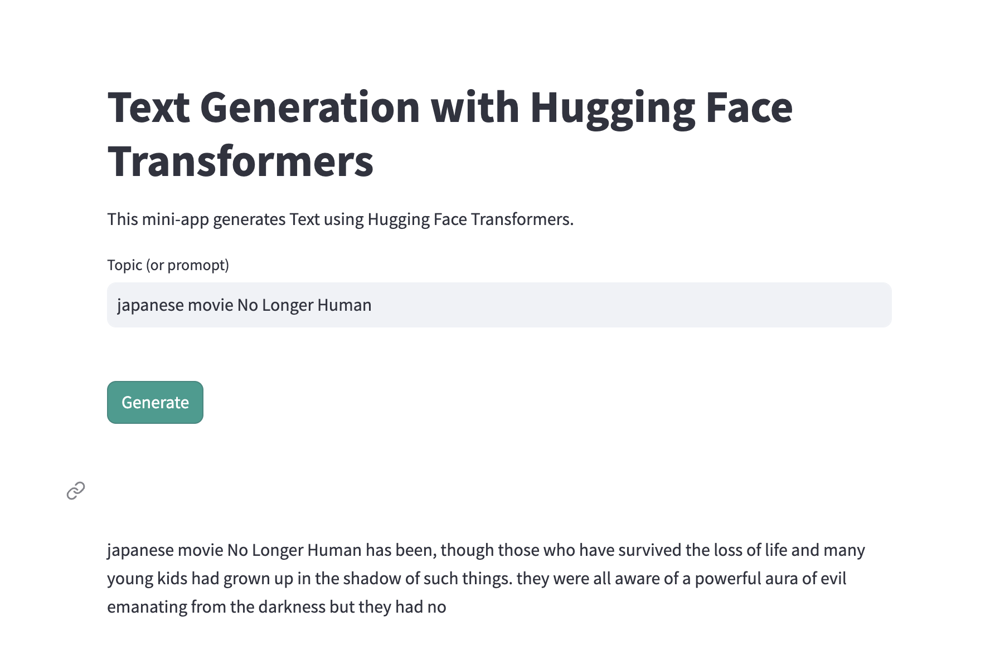

# Text Generation with Hugging Face Transformers

## Introduction
This Streamlit app generates text using the Hugging Face Transformers library. It utilizes a pre-trained language model to generate text based on a given topic or prompt.

## Main Function

The main function of the application is defined in the `main()` function within the `hello.py` file. Here's a breakdown of what it does:

1. **Page Configuration**: Sets the page title and adds styling.
2. **Title and Description**: Displays the title and a brief description of the app.
3. **Text Input Area**: Provides a text input area for users to enter the topic or prompt for text generation.
4. **Generate Button**: Allows users to trigger text generation based on the input topic or prompt.
5. **Display Generated Text**: Shows the generated text with styling.

## Usage

Follow these steps to set up, test, and publish the Streamlit app:

1. **Install Streamlit**: Ensure you have Streamlit installed. You can install it using pip:
    ```bash
    pip install streamlit
    ```

2. **Test Locally**: Verify that Streamlit is installed correctly by running a simple "Hello, World!" application locally:
    ```bash
    streamlit hello
    ```

3. **Install Dependencies**: Install the required dependencies listed in the `requirements.txt` file using pip:
    ```bash
    pip install -r requirements.txt
    ```

4. **Run the Application**: Run the Streamlit app by executing the following command in your terminal:
    ```bash
    streamlit run hello.py
    ```

5. **Interact with the App**: Once the app is running, you can interact with it by entering a topic or prompt in the text input area and clicking the "Generate" button.

6. **Publish to Streamlit.io**:
    - Sign up for an account on [Streamlit.io](https://streamlit.io/).
    - Connect your Streamlit account to your GitHub repository.
    - Under "My Apps" and then "New App", use your existing repository from GitHub and configure your application settings.
    - - Customize my URL to `https://yuwen-ids721-mini9.streamlit.app/`.

## Additional Notes

- Ensure that you have the necessary dependencies installed before running the application.
- Experiment with different topics and prompts to see how the text generation model performs.

## Example Screenshot



